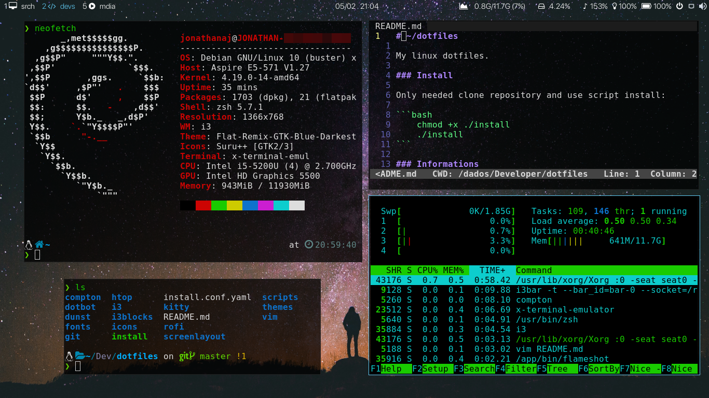

# ~/dotfiles

My linux dotfiles.

### Install

Only needed clone repository and use script install:

```bash
    chmod +x ./install
    ./install
```



### Informations

- WM: i3wm
- Bar: i3blocks + contrib
- Menus: rofi
- Notification: dunst
- Compositor: compton
- Terminal: kitty 
- Text Editor: vim + dracula
- Shell: zsh + p10k
- Icons: Suru++
- Theme: Flat-Remix-GTK-Blue-Darkest
- Font: San Francisco pro

enjoy :)
